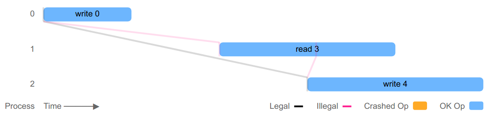

# Knossos


Given a history of operations by a set of clients, and some singlethreaded
model, attempts to show that the history is not linearizable with respect to
that model. I am not certain the algorithm is correct yet; you should treat its
results as plausible but verify by hand.

Named after the ruins where the Linear B script was discovered. You know,
because we're testing if the history "be linear". YES IT'S A HISTORY PUN WORK
WITH ME HERE OKAY?

## Installation

Via [Clojars](https://clojars.org/knossos), as usual.

## Quickly!

You can check a CAS register, initialized to `nil`, on an EDN history file,
like so:

```bash
$ lein run data/cas-register/bad/bad-analysis.edn
data/cas-register/bad/bad-analysis.edn  false
```

## Concepts

Every logical transition in Knossos is represented by a pair of operations: an
invoke, when the op begins, and a completion: either ok if the operation took
place, fail if the operation did not take place, or info if you're not sure
what happened, e.g. the operation timed out.

Operations are performed by logical processes, which can be any object.
Typically you'll use small integers, e.g. `0, 1, 2, ...`. A process can only do
one thing at a time. If a process times out after invoking an operation, it is
said to be *crashed* and cannot perform another operation ever again.

Operations apply some *transition function* `:f` to the object they're
interacting with, e.g. a `:read` or a `:write`. That function takes a `:value`,
which encapsulates its arguments and return values. Values may be complex
datatypes, so to represent a compare-and-set from 0 to 3, you might use `:value [0 3]`.

So, a crashed write of 3, concurrent with a read of 3, might look like:

```clj
{:process 0, :type :invoke, :f :read, :value nil}
{:process 1, :type :invoke, :f :write, :value 3}
{:process 1, :type :info, :f :write, :value 3}
{:process 0, :type :ok, :f :read, :value 3}
```

If this is the entire history, we can infer that this history is linearizable:
the crashed operation did in fact take place, and linearized prior to the read
of 3. Notice that we don't have to provide a value for invocations if we don't
know what it will be in advance--for instance, during a read. Knossos will fill
in the invocation's `:value` from the completion operation, when possible.

You'll also need a model--see [knossos.model](src/knossos/model.clj), which
defines a singlethreaded datatype and how it reacts to operations. Knossos
defines some built-in models like a register, a register with compare-and-set,
and a mutex, which you can choose at the CLI via `--model mutex` and so on.

## At the command line

If you have a history for a compare-and-set register in an `edn` file, either
as a series of operation maps, or as a single vector or list containing those
operations, you can ask knossos to check it for you at the command line like
so:

```clj
lein run --model cas-register my-file.edn
```

Knossos prints out the names of all files you asked it to check, followed by a tab, and then whether the history was valid. There are thre validity states:

- `true`      means the history was linearizable
- `false`     means the history was nonlinearizable
- `:unknown`  means knossos was unable to complete the analysis; e.g. it ran
              out of memory.

## As a library

You'll probably want to invoke knossos as a library. Pull in `knossos.model`
for a selection of models (or to write your own), and `knossos.competition` for
the most efficient general-purpose algorithm, which runs both a graph search
(`knossos.linear`) and a tree search (`knossos.wgl`) in parallel.

```clj
$ lein repl
knossos.cli=> (require '[knossos.model :as model] '[knossos.competition :as competition])
nil
knossos.cli=> (competition/analysis (model/cas-register 0) [{:process 0, :type :invoke, :f :read, :value nil}
         #_=> {:process 1, :type :invoke, :f :write, :value 3}
                  #_=> {:process 1, :type :info, :f :write, :value 3}
                           #_=> {:process 0, :type :ok, :f :read, :value 3}])
{:configs ({:last-op {:f :read :index 3 :process 0 :type :ok :value 3}
            :model #knossos.model.CASRegister {:value 3}
                        :pending []})
 :valid? true}
```

Or we can try an invalid history. For instance, here's a minimal failing case
adapted from a test on the RethinkDB key-value store, which allowed failed
writes to be read by clients during pathological failure modes.

```clj
knossos.cli=> (def h (read-history "data/cas-register/bad/rethink-fail-minimal.edn"))
#'knossos.cli/h

knossos.cli=> (pprint h)
[{:type :invoke, :f :write, :value 0, :process 0}
 {:type :ok, :f :write, :value 0, :process 0}
 {:type :invoke, :f :read, :value nil, :process 1}
 {:type :invoke, :f :write, :value 4, :process 2}
 {:type :ok, :f :read, :value 3, :process 1}
 {:type :ok, :f :write, :value 4, :process 2}
 {:type :invoke, :f :read, :value nil, :process 3}
 {:type :ok, :f :read, :value 4, :process 3}]

knossos.cli=> (def a (competition/analysis (model/cas-register) h))
{:configs ({:last-op {:f :write :index 1 :process 0 :type :ok :value 0}
            :model #knossos.model.CASRegister {:value 0}
            :pending [{:f :read :index 2 :process 1 :type :invoke :value 3}
                      {:f :write :index 3 :process 2 :type :invoke :value 4}]})
 :final-paths #{[{:model #knossos.model.CASRegister {:value 0}
                  :op {:f :write :index 1 :process 0 :type :ok :value 0}}
                 {:model #knossos.model.Inconsistent
                  {:msg "can't read 3 from register 0"}
                  :op {:f :read :index 4 :process 1 :type :ok :value 3}}]
                [{:model #knossos.model.CASRegister {:value 0}
                  :op {:f :write :index 1 :process 0 :type :ok :value 0}}
                 {:model #knossos.model.CASRegister {:value 4}
                  :op {:f :write :index 3 :process 2 :type :invoke :value 4}}
                 {:model #knossos.model.Inconsistent
                  {:msg "can't read 3 from register 4"}
                  :op {:f :read :index 4 :process 1 :type :ok :value 3}}]}
 :last-op {:f :write :index 1 :process 0 :type :ok :value 0}
 :op {:f :read :index 4 :process 1 :type :ok :value 3}
 :previous-ok {:f :write :index 1 :process 0 :type :ok :value 0}
 :valid? false}
```

`:valid? false` indicates the history was nonlinearizable. `:op` shows the
first OK operation we weren't able to linearize through, and is a good hint as
to where things in the history went wrong. We also have a `:previous-ok` which
was the highest contiguously linearized OK operation in the history: where we
knew things were still OK. In between those operations we have a series of
`:final-paths`, which show various ways we could order the available concurrent
operations at that time, and how each of those orders resulted in an illegal
state transition, e.g. reading the value `3` from a register whose value was
actually `4`.

## Visualization of faults

To visualize these errors, we can use `knossos.linear.report` to generate an
interactive SVG visualization of the crucial part of the history.

```clj
knossos.cli=> (require '[knossos.linear.report :as report])

knossos.cli=> (report/render-analysis! h a "linear.svg")
```

Now open `linear.svg` in your browser, and you can explore the different paths that lead to the checker running out of options.



## License

Copyright © 2013, 2016, 2017 Kyle Kingsbury

Distributed under the Eclipse Public License, the same as Clojure.
